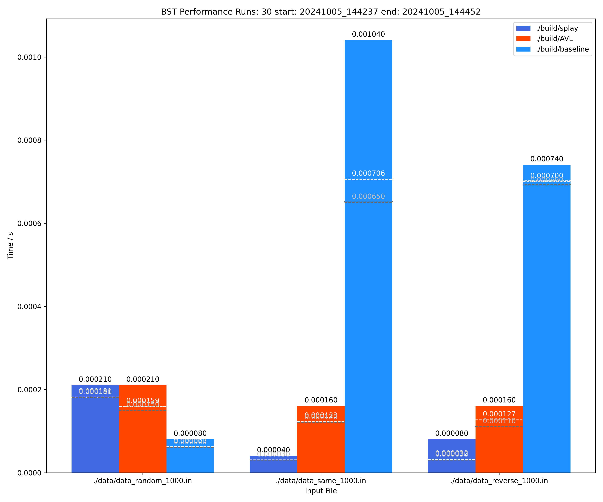
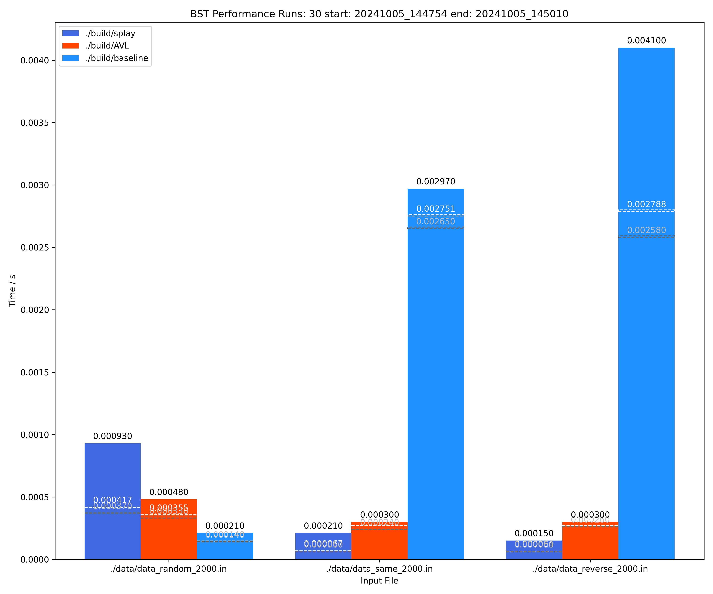
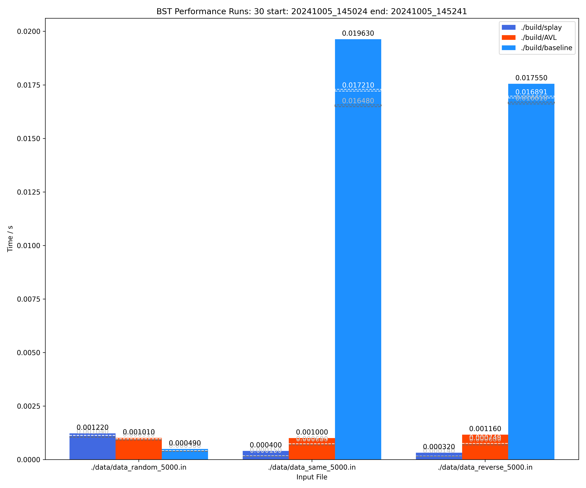
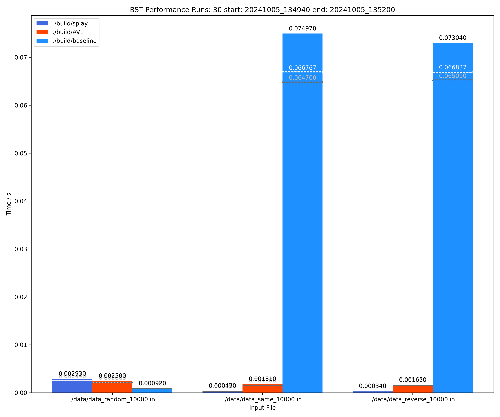

# Project 1: Binary Search Trees

先在这个文档里写，到时候我再用 $\LaTeX$ 改写一下.

## Introduction

TODO

## Algorithm Specification

### Binary Search Tree

### AVL Tree

#### 节点结构

```c++
struct Node{
    int data;//data of node
    int h_left;//height of left subtree
    int h_right;//height of right subtree
    // int hei;//height of node
    int det;//balance factor equal to h_left - h_right
    Node* left;//left child
    Node* right;//right child
    Node* pa;//parent node
};
```

#### AVL 树结构与操作

```c++
//create Node
Node * createNode(int data);
//renew height and balance factor of node
void Refresh(Node* node);
//class AVL
struct AVL{
    Node* root;
    //init AVL
    void init();
    //left rotate
    void twistL(Node *node);
    //right rotate
    void twistR(Node *node);
    //rebalance
    void balance(Node *temp);
    //insert key x into AVL
    void ins(int x);
    //search key x in AVL, return node if found, else return NULL
    Node * Find(int x);
    //remove node temp from AVL
    void remove_Node(Node* temp);
    //delete key x from AVL, return 1 if success, else return 0
    int del(int x);
};
```

接口：

- **Search:** `<对象名称>.Find(<键>);`，返回节点指针，如果不存在返回 NULL

- **Insert:** `<对象名称>.ins(<键>);`

- **Delete:** `<对象名称>.del(<键>);`

#### 左旋的实现

将右子树的左子树作为原来子树的根的右子树，将右子树作为新的根的右子树，将右儿子作为新的根，原先根作为新根的右儿子，并更新父节点的子节点指针。

#### 右旋的实现

将左儿子的右子树作为原来子树的根的左子树，将左子树作为新的根的左子树，将左儿子作为新的根，原先根作为新根的右儿子，并更新父节点的子节点指针。

#### 平衡操作的实现

平衡操作是指当某节点的高度或平衡因子发生变化时，需要对其父节点及祖先节点进行调整，以保持树的平衡性。
若因为右儿子的右儿子过高导致的不平衡，则左旋。若因为左儿子的左儿子过高导致的不平衡，则右旋后左旋。若因为左儿子的右儿子过高导致的不平衡，则右旋。若因为右儿子的左儿子过高导致的不平衡，则左旋后右旋。

#### 插入节点的实现

若插入的节点为根节点，则直接创建该节点为根节点；
若插入的节点不为根节点，则从根节点开始，若插入的节点的键值小于当前节点的键值，则移动到当前节点的左子树；若插入的节点的键值大于等于当前节点的键值，则移动到当前节点的右子树；
当移动到叶子节点时，则创建该节点为叶子节点；
当移动到非叶子节点时，则更新该节点的高度和平衡因子；
当移动到某节点时，若该节点的平衡因子大于1或小于-1，则进行旋转操作，直到该节点的平衡因子恢复正常；

#### 删除单节点

查找节点后，若该节点为叶子节点或者只有右子树，则直接删除该节点；
若该节点有左子树，则用左子树的最大节点替换该节点，并删除该节点；
从该节点到根节点，若该节点的平衡因子大于1或小于-1，则进行旋转操作，直到该节点的平衡因子恢复正常；

具体的实现代码位于 `src/AVL.cpp` 中，在此不再赘述.

### Splay Tree

#### 核心思想

在对某个节点 $X$ 任意形式的访问后，都要将其通过 Splay 操作旋转到根节点处.

#### 节点结构

```c++
struct Node {
    int key;         // The key of the node
    int value;       // The value of the node
    Node* left;      // The left child of the node
    Node* right;     // The right child of the node
    Node* parent;    // The parent of the node
    int pos;         // Position of node in the tree (0 for root, 1 for left child, -1 for right child)

    // Constructor
    Node(int _key = 0, int _value = 0, Node* _left = nullptr, Node* _right = nullptr, Node* _parent = nullptr, int _pos = 0) : key(_key), value(_value), left(_left), right(_right), parent(_parent), pos(_pos) {}
};
```

#### Splay 树结构与操作

```c++
struct SplayTree {
    Node* root;  // root of the tree
    int size;    // number of nodes in the tree

    SplayTree();                      // Constructor
    void rotateLeft(Node* p);         // Left rotation on the right child of p
    void rotateRight(Node* p);        // Right rotation on the left child of p
    void splay(Node* x);              // Splay x to root
    bool select(int key);             // search for key in tree
    bool insert(int key, int value);  // insert key-value pair into tree
    bool remove(int key);             // remove key from tree
};
```

接口：

- **Search:** `<对象名称>.select(<键>);`，返回给定键是否存在，若存在返回 true，否则返回 false

- **Insert:** `<对象名称>.ins(<键>, <值>);`，尝试向 Splay 树中插入给定键值对，若成功返回 true，否则返回 false

- **Delete:** `<对象名称>.del(<键>);`，尝试从 Splay 树中删除给定键，若成功返回 true，否则返回 false

下面我们先实现 Splay 树的基本操作，然后再实现 AVL 树和 Splay 树的接口.

#### 基本操作 / Splay 操作

我们设 $X$ 的父节点为 $P$，$P$ 的父节点为 $G$（如果存在），Splay 操作分为三类：

1. **zig:** 若 $P$ 为根节点，则只需做一次与 AVL 树中相同的旋转操作即可将 $X$ 旋转到根节点处；

2. **zig-zig:** 若 $P$ 不是根节点，且 G-P-X 的关系是 LL 或 RR，则先对 $P$ 做旋转，再对 $X$ 做旋转，将 $X$ 旋转到原本 $G$ 的位置；

3. **zig-zag:** 若 $P$ 不是根节点，且 G-P-X 的关系是 LR 或 RL，则先对 $X$ 做旋转，再对 $P$ 做旋转，将 $X$ 旋转到原本 $G$ 的位置.

为了实现 Splay 操作，我们需要先实现左旋与右旋操作，这些操作在 AVL 树部分已有说明，此处不再赘述. 在两种旋转操作的基础上，我们只需要实现 Splay 操作的控制流即可：

```c++
// Splay the node x to the root
void splay(Node* x) {
    // Splay up until x is the root
    while (x != nullptr && x != root) {
        Node* p = x->parent;
        if (p == root) {
            // zig case
            if (x->pos == 1)
                rotateRight(p);
            else if (x->pos == -1)
                rotateLeft(p);
        } else {
            Node* g = p->parent;
            if (p->pos == 1 && x->pos == 1) {
                // zig-zig case
                rotateRight(g);
                rotateRight(p);
            }
            else if (p->pos == -1 && x->pos == -1) {
                // zig-zig case
                rotateLeft(g);
                rotateLeft(p);
            }
            else if (p->pos == 1 && x->pos == -1) {
                // zig-zag case
                rotateLeft(p);
                rotateRight(g);
            }
            else if (p->pos == -1 && x->pos == 1) {
                // zig-zag case
                rotateRight(p);
                rotateLeft(g);
            }
        }
    }
}
```

#### 查询操作

1. 先按照普通二叉搜索树的查询操作，找到节点 $X$；

2. 若 $X$ 不是根节点，则将其旋转到根节点处.

#### 插入操作

1. 按照普通二叉搜索树的插入操作，将节点 $X$ 插入；

2. 若 $X$ 不是根节点，则将其旋转到根节点处.

#### 删除操作

1. 按照普通二叉搜索树的查询操作，找到待删除节点 $X$；

2. 若 $X$ 不是根节点，则将其旋转到根节点处；

3. 删除根节点，并将其左右子树合并：

   1. 若左（右）子树为空，则用右（左）子树替代根节点；
   
   2. 若左右子树均不为空，则找到左（右）子树的最大（最小）节点，用该节点替代根节点，并将该节点删除.

具体的实现代码位于 `src/splay.cpp` 中，在此不再赘述.

## Testing Results

### 正确性验证

为验证三种 BST 的正确性，我们需要对其进行以下几种测试：

1. 对三种 BST 的插入和删除操作的正确性进行测试；

2. 对于 AVL 树，验证其实现是否为一个平衡二叉树；

#### 插入和删除操作正确性

验证方法：建立一个列表，用朴素方法插入删除，并对 BST 执行相同的操作. 之后将二叉搜索树的中序遍历结果与列表的顺序遍历结果进行比较，如果相同则验证成功。

- 列表的插入和删除：

    ```c++
    void List::init(){
        tot=0;
        memset(List,0,sizeof(List));
    }
    void List::ins(int y){//insert y into the list
        tot++;
        int j;
        for(j=tot;j>1;j--){//find the position to insert y
            if(List[j-1]<=y){
                break;
            }
            List[j]=List[j-1];//shift the elements to the right
        }
        List[j]=y;//insert y into the position j
    }
    int List::del(int y){//delete the first occurrence of y from the list
        int j;
        for(j=1;j<=tot;j++){//find the position of y
            if(List[j]==y){
                break;
            }
        }
        if(j==tot+1){//y is not in the list
            return 0;
        }
        else{//y is in the list
            for(;j<tot;j++){
                List[j]=List[j+1];
            }
            tot--;
            return 1;
        }
    }
    ```

- 二叉搜索树的中序遍历

    ```c++
    int checkorder(Node* node,int List[],int *cnt) {
        if(node==NULL){
            return 1;
        }
        int res=1;
        if(node->left){//check the left subtree
            res&=checkorder(node->left,List,cnt);
        }
        (*cnt)++;
        if(List[*cnt]!=node->data){//check whether the order is same to the given list
            res=0;
        }
        if(node->right){//check the right subtree
            res&=checkorder(node->right,List,cnt);
        }
        return res;
    }
    ```

#### 验证平衡性

对于 AVL 树，我们使用朴素方法深度优先遍历二叉树，并计算每个节点的高度和平衡因子，如果高度差大于 1 则验证失败。

```c++
int checkdepth(Node* node,int *res) {
    if(node==NULL){
        // *res=1;
        return 0;
    }
    int temp=1,left_height=0,right_height=0;
    if(node->left){//get the height of left subtree
        left_height=checkdepth(node->left,&temp);
    }   
    if(node->right){//get the height of right subtree
        right_height=checkdepth(node->right,&temp);
    }
    if(temp==0||(abs(left_height-right_height)>1)){//if the height difference is greater than 1 or the subtree is not balancesd, the tree is not balanced
        *res=0;        
    }
    return max(left_height,right_height)+1;
}
```

#### 随机数据生成与验证

通过 `rand()` 函数生成随机数据插入，在 `List` 中选择数据，小概率选择 `List` 外数据进行删除，并验证是否正确。

```c++
AVL myavl;// global AVL tree
List a;// global list to store the elements to check the order of the AVL tree
int main() {
    int N=10,M=10;
    srand(time(NULL));
    printf("Enter the turns and the number of elements\n");
    scanf("%d%d", &M,&N);//set the number of turns and the number of elements to generate
    int MM=M;
    while(MM--){
        a.init();//set the list to empty
        myavl.init();//set the AVL tree to empty
        for(int i=0;i<N;i++){
            // printf("%d\n",i);
            // int x,y;
            int x=rand()%4+1,y;
            if(x<=3){//set the operation to insert or delete 3:1
                x=1;
            }
            else{
                x=2;
            }
            if(x==2){//delete elements are mosetly chosen randomly from the list 
                y=rand()%(a.tot+1)+1;
                if(y<=a.tot){
                    y=a.List[y];
                }
                else{
                    y=a.List[a.tot]+3;
                }
            }
            else{
                y=rand()%100+1;
            }
            if(x==1){
                myavl.ins(y);
                a.ins(y);
            }
            else{
                if((myavl.del(y))!=(a.del(y))){//check whether the delete operation is correct if not stop the program
                    printf("Error \n");
                    return 0;
                }   
            }
            int res=1,flag=1;
            checkdepth(myavl.root,&flag);//check the balance of the AVL tree
            if(!flag){
                printf("The AVL tree is not balanced\n");
                return 0;
            }
            int cnt=0;
            flag=checkorder(myavl.root,a.List,&cnt);//check the order of the AVL tree
            if(!flag){
                printf("The AVL tree is not in order\n");
                return 0;
            }            
        }
        printf("finish turn %d of %d\n",M-MM,M);
    }
    
    return 0;
}

```
陆续进行了 1000 轮测试，每一轮测试 10000 组插入删除数据，经过测试，AVL 树均保持平衡并正确的插入和删除数据。

### 性能测试

#### 测试数据生成

`utils/dataGen.py` 负责根据不同的数据规模 $N$ 生成所需的三类数据：

1. `data_same_N.in`: 升序插入 $N$ 个元素，再升序删除 $N$ 个元素；

2. `data_reverse_N.in`: 升序插入 $N$ 个元素，再降序删除 $N$ 个元素；

3. `data_random_N.in`: 按随机顺序插入 $N$ 个元素，再按随机顺序删除 $N$ 个元素.

生成的输入数据文件保存在 `data` 文件夹下.

#### 测试结果

`utils/autobench.py` 负责执行程序，向其输入上一步生成的测试数据，获取程序运行 30 次的最短时间、平均时间和最长时间，并生成可视化输出.

测试结果如下：









详细数据如下表所示：

|          | 1000                       | 2000                       |
|----------|----------------------------|----------------------------|
| Splay    | 0.000181/0.000038/0.000032 | 0.000417/0.000067/0.000064 |
| AVL      | 0.000159/0.000123/0.000127 | 0.000355/0.000269/0.000270 |
| Baseline | 0.000083/0.000706/0.000700 | 0.000146/0.002751/0.002788 |

|          | 5000                       | 10000                      |
|----------|----------------------------|----------------------------|
| Splay    | 0.001126/0.000169/0.000158 | 0.002476/0.000314/0.000319 |
| AVL      | 0.000966/0.000734/0.000749 | 0.002092/0.000154/0.000154 |
| Baseline | 0.000413/0.017210/0.016891 | 0.000877/0.066767/0.066837 |

（单位：秒，数据格式为：random/same-order/reverse-order）

## Analysis

TODO
