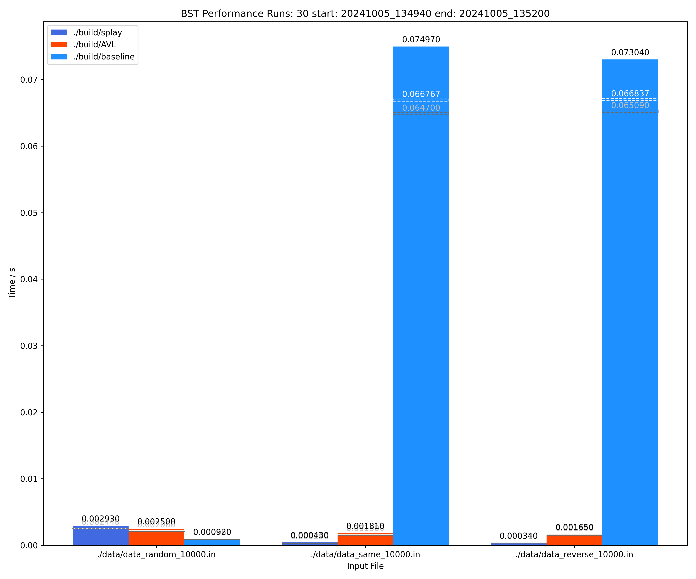

# Project 1: Binary Search Trees

先在这个文档里写，到时候我再用 $\LaTeX$ 改写一下.

## Introduction
<p>本项目通过实现三种不同的二叉搜索树（BST），即普通不平衡二叉搜索树（Unbalanced BST）、AVL树和Splay树，并对它们在不同插入与删除操作下的性能进行对比和分析。为了深入了解这些树结构在处理不同输入数据和操作顺序时的表现，我们将通过多次测试运行，收集数据并生成图表来展示它们的性能差异。</p>

### Objectives

项目的主要目标如下:<br>

**实现数据结构**: 为三种树结构（Unbalanced BST、AVL树和Splay树）实现所有必要的操作函数，包括插入、删除和查找。<br>

**数据生成与性能测试**: 根据三种不同的插入和删除场景，生成测试数据<br>

Case 1（相同顺序）：按升序插入N个整数，并按相同顺序删除。<br>
Case 2（逆序删除）：按升序插入N个整数，并按降序删除。<br>
Case 3（随机顺序）：按随机顺序插入和删除N个整数。<br>
输入数据的规模将覆盖从1000到10000个整数，并为每种场景生成对应的数据文件，用于测试框架执行性能分析。<br>

**性能测试与数据收集**: 我们将运行测试框架，对三种数据结构执行多次性能测试，记录插入、删除操作的运行时间，并输出结果。测试将运行多次以消除偶然误差，并确保测试结果的稳定性和准确性。<br>

**数据可视化**: 测试结束后，收集到的数据将被用于生成柱状图，展示不同配置下三种树结构的最大、平均和最小运行时间。通过图表对比，可以直观展示三种树结构在各种操作场景下的性能表现。<br>

**结果分析**: 通过分析生成的运行时间数据和图表，比较三种数据结构在不同操作和数据规模下的性能差异，进一步了解它们的优缺点及适用场景。<br>

### Data Structures Overview

**Unbalanced Binary Search Tree (BST)**:普通BST不维护平衡，因此在最坏情况下其插入、删除和查找操作的时间复杂度会退化到O(N)。<br>
**AVL Tree**: AVL树通过平衡左右子树的高度差不超过1来维持平衡，保证了O(log N)的时间复杂度。<br>
**Splay Tree**: Splay树通过将频繁访问的节点旋转至树根，提高了对频繁访问节点的效率，具有O(log N)的摊销复杂度。<br>

### Methodology
**数据生成**: 通过Python脚本生成不同类型的数据文件，包含三种插入与删除操作的场景，用于测试不同输入规模下的树性能。<br>

**性能测试**: 运行指定的程序并将不同的数据文件作为输入，测试程序的执行时间，并收集最大值、最小值和平均运行时间。

**可视化**:使用Matplotlib生成柱状图，展示各类树结构在不同测试场景下的性能表现，图表将清晰显示出运行时间的最大值、平均值和最小值。

**结果分析**: 通过图表直观展示不同树结构在不同输入规模下的性能，并结合最大、平均和最小时间的对比，深入分析它们的表现差异。


## Algorithm Specification
### AVL树部分报告
#### AVL树插入和删除的实现
##### 声明
```c++
// avltree.h
#ifndef AVLTREE_H
#define AVLTREE_H

#include <stdio.h>
#include <stdlib.h>
void swap(int *x,int *y);
int max(int x,int y);
//定义节点结构
struct Node{
    int data;//data of node
    int h_left;//height of left subtree
    int h_right;//height of right subtree
    // int hei;//height of node
    int det;//balance factor equal to h_left - h_right
    Node* left;//left child
    Node* right;//right child
    Node* pa;//parent node
};
//create Node
Node * createNode(int data);
//renew height and balance factor of node
void Refresh(Node* node);
//class AVL
struct AVL{
    Node* root;
    //init AVL
    void init();
    //left rotate
    void twistL(Node *node);
    //right rotate
    void twistR(Node *node);
    //rebalance
    void balance(Node *temp);
    //insert key x into AVL
    void ins(int x);
    //search key x in AVL, return node if found, else return NULL
    Node * Find(int x);
    //remove node temp from AVL
    void remove_Node(Node* temp);
    //delete key x from AVL, return 1 if success, else return 0
    int del(int x);
};
//check if AVL is balanced return the height of the subtree and res is whether the AVL is balanced, 1 is balannced 0 is not balanced
int checkdepth(Node* node,int *res);
//check if AVL is in order, return 1 if in order, else return 0
int checkorder(Node* node,int List[],int *cnt);
//print AVL node by node
void printtree(Node* node);
#endif
```
使用`<类名称>.ins(<键值>);`插入键值，使用`<类名称>.del(<键值>);`删除键值，使用`<类名称>.Find(<键值>);`查找键值，返回节点指针，如果不存在返回NULL。
##### 左旋的实现
将右子树的左子树作为原来子树的根的右子树，将右子树作为新的根的右子树，将右儿子作为新的根，原先根作为新根的右儿子，并更新父节点的子节点指针。
##### 右旋的实现
将左儿子的右子树作为原来子树的根的左子树，将左子树作为新的根的左子树，将左儿子作为新的根，原先根作为新根的右儿子，并更新父节点的子节点指针。

##### 平衡操作的实现
平衡操作是指当某节点的高度或平衡因子发生变化时，需要对其父节点及祖先节点进行调整，以保持树的平衡性。
若因为右儿子的右儿子过高导致的不平衡，则左旋。若因为左儿子的左儿子过高导致的不平衡，则右旋后左旋。若因为左儿子的右儿子过高导致的不平衡，则右旋。若因为右儿子的左儿子过高导致的不平衡，则左旋后右旋。
##### 插入节点的实现
若插入的节点为根节点，则直接创建该节点为根节点；
若插入的节点不为根节点，则从根节点开始，若插入的节点的键值小于当前节点的键值，则移动到当前节点的左子树；若插入的节点的键值大于等于当前节点的键值，则移动到当前节点的右子树；
当移动到叶子节点时，则创建该节点为叶子节点；
当移动到非叶子节点时，则更新该节点的高度和平衡因子；
当移动到某节点时，若该节点的平衡因子大于1或小于-1，则进行旋转操作，直到该节点的平衡因子恢复正常；

##### 删除单节点
查找节点后，若该节点为叶子节点或者只有右子树，则直接删除该节点；
若该节点有左子树，则用左子树的最大节点替换该节点，并删除该节点；
从该节点到根节点，若该节点的平衡因子大于1或小于-1，则进行旋转操作，直到该节点的平衡因子恢复正常；

### BASELINE普通二叉搜索树部分报告
#### 二叉树结构

##### 节点
```cpp
struct Node {
    int key;         // The key of the node, used for ordering nodes in the binary search tree
    int value;       // The value stored in the node, can be any data associated with the key
    Node* left;      // Pointer to the left child of this node, stores nodes with keys less than the current node's key
    Node* right;     // Pointer to the right child of this node, stores nodes with keys greater than the current node's key
    Node* parent;    // Pointer to the parent node, used to keep track of the parent for easier tree adjustments

    // Constructor to initialize a Node
    // _key: the key for ordering the node
    // _value: the value associated with the key
    // _left: pointer to the left child (default is nullptr)
    // _right: pointer to the right child (default is nullptr)
    // _parent: pointer to the parent node (default is nullptr)
    Node(int _key = 0, int _value = 0, Node* _left = nullptr, Node* _right = nullptr, Node* _parent = nullptr)
        : key(_key), value(_value), left(_left), right(_right), parent(_parent) {}
};

```
##### 整棵树
```cpp
class BST {
public:
    Node* root;  // Pointer to the root of the tree
    int size;    // Keeps track of the number of nodes in the tree

    // Constructor for the Binary Search Tree (BST)
    // Initializes an empty tree
    BST() {
        root = nullptr;  // The root is initially null (empty tree)
        size = 0;        // Size starts at 0 since there are no nodes
    }

private:
    // Helper function to replace a node with a new node in the parent link
    // node: the current node to be replaced
    // newNode: the new node that will take the place of 'node'
    void replaceNodeInParent(Node* node, Node* newNode) {
        // If node is the root, update the root to newNode
        if (node->parent == nullptr) {
            root = newNode;
        } else {
            // If node is a left child, update the left pointer in its parent
            if (node == node->parent->left) {
                node->parent->left = newNode;
            } 
            // Otherwise, update the right pointer in its parent
            else {
                node->parent->right = newNode;
            }
        }
        // Update the parent pointer in the newNode
        if (newNode != nullptr) {
            newNode->parent = node->parent;
        }
    }

    // Helper function to find the minimum node in a subtree
    // This is typically used to find the in-order successor
    Node* findMin(Node* node) {
        // Traverse to the leftmost node, which is the minimum in a BST
        while (node->left != nullptr) {
            node = node->left;
        }
        return node;  // Return the minimum node
    }

    // Depth-first traversal of the tree to print its structure
    // x: the current node being visited
    void dfs(Node* x) {
        if (x == nullptr) return;  // Base case: if node is null, return
        
        // Print the key and value of the current node
        printf("%d: value = %d", x->key, x->value);

        // Print the key of the left child if it exists
        if (x->left != nullptr)
            printf(", left = %d", x->left->key);

        // Print the key of the right child if it exists
        if (x->right != nullptr)
            printf(", right = %d", x->right->key);

        // Print the key of the parent if it exists
        if (x->parent != nullptr)
            printf(", parent = %d", x->parent->key);

        printf("\n");  // Move to the next line

        // Recursively visit the left and right children
        dfs(x->left);
        dfs(x->right);
    }
};

```
#### 主要实现方法
1. 插入操作：<br>从根节点开始，通过比较节点值递归插入。
2. 删除操作：<br>删除某个节点时，分为三种情况：叶子节点、只有一个子节点的节点、和有两个子节点的节点。
3. 查找操作：<br>从根节点依次向左或向右递归查找目标节点。

**代码实现**
<br>插入操作
<p>插入一个新节点的过程如下：<br>

从根节点开始，沿着树往下找到适当的位置：<br>
如果新节点的键值小于当前节点的键值，进入左子树。<br>
如果新节点的键值大于当前节点的键值，进入右子树。<br>
一旦找到合适的空位置，将新节点插入该位置，作为父节点的左子节点或右子节点。<br>
更新树的大小。</p>
```cpp
bool insert(int key, int value) {
    // If the tree is empty, create a new root node with the given key and value
    if (size == 0) {
        root = new Node(key, value);  // Set the root to the new node
        size++;                       // Increment the size of the tree
        return true;                  // Return true to indicate successful insertion
    }

    // Create a new node with the given key and value
    Node* ins = new Node(key, value);
    Node* x = root;        // Start the search from the root
    Node* parent = nullptr; // To keep track of the parent of the current node

    // Traverse the tree to find the correct position for the new node
    while (x != nullptr) {
        parent = x;  // Store the current node as the parent before moving
        if (key < x->key)        // If the new key is less than the current node's key,
            x = x->left;         // move to the left child
        else if (key > x->key)   // If the new key is greater than the current node's key,
            x = x->right;        // move to the right child
        else {
            // Duplicate keys are not allowed in the tree
            delete ins;          // Delete the new node since it can't be inserted
            return false;        // Return false to indicate insertion failure
        }
    }

    // Once the correct position is found, link the new node to its parent
    ins->parent = parent;         // Set the parent pointer of the new node

    // Attach the new node as the left or right child based on the key comparison
    if (key < parent->key) {
        parent->left = ins;       // If the key is smaller, insert as the left child
    } else {
        parent->right = ins;      // If the key is larger, insert as the right child
    }

    size++;                       // Increment the size of the tree
    return true;                  // Return true to indicate successful insertion
}
```
<br> 删除操作
<p>无子节点（叶子节点）：直接从树中移除该节点。<br>
只有一个子节点：将该节点的子节点提升为该节点的位置，即用该节点的唯一子节点替换它。<br>
有两个子节点：<br>
找到该节点的中序后继节点（右子树中的最小节点）。<br>
将后继节点的键值复制到要删除的节点。<br>
删除后继节点（后继节点最多只有一个子节点，转化为第一种或第二种情况处理）。</p>

```cpp
bool remove(int key) {
    // Search for the node with the given key
    Node* node = searchNode(key);
    
    // If the node is not found, return false (node with the key doesn't exist)
    if (node == nullptr)
        return false;

    // Case 1: Node has no children (a leaf node)
    if (node->left == nullptr && node->right == nullptr) {
        replaceNodeInParent(node, nullptr);  // Just remove the node
    }
    // Case 2: Node has one child (only right child exists)
    else if (node->left == nullptr) {
        replaceNodeInParent(node, node->right);  // Replace node with its right child
    }
    // Case 2: Node has one child (only left child exists)
    else if (node->right == nullptr) {
        replaceNodeInParent(node, node->left);   // Replace node with its left child
    }
    // Case 3: Node has two children
    else {
        // Find the in-order successor (smallest node in the right subtree)
        Node* successor = findMin(node->right);
        
        // Replace the key and value of the node to be deleted with the successor's
        node->key = successor->key;
        node->value = successor->value;

        // Remove the successor from its original position
        replaceNodeInParent(successor, successor->right);
    }

    // Delete the original node and decrease the tree size
    delete node;
    size--;
    
    return true;  // Return true to indicate successful removal
}

```

<br>查找操作
<p>查找某个键值在树中的节点的过程如下：

从根节点开始。
比较要查找的键值与当前节点的键值：<br>
如果要查找的键值比当前节点的键值小，则进入左子树。<br>
如果要查找的键值比当前节点的键值大，则进入右子树。<br>
如果找到相同的键值，则返回该节点。<br>
如果遍历到叶子节点仍未找到匹配的键值，则返回nullptr，表示树中不存在该节点。</p>
```cpp
Node* searchNode(int key) {
    Node* x = root;  // Start searching from the root of the tree

    // Traverse the tree until the node is found or we reach a null pointer
    while (x != nullptr) {
        if (key < x->key)              // If the key is smaller than the current node's key,
            x = x->left;               // move to the left child
        else if (key > x->key)         // If the key is greater than the current node's key,
            x = x->right;              // move to the right child
        else                           // If the keys are equal,
            return x;                  // return the current node (node found)
    }
    
    // If the loop exits without finding the key, return nullptr (node not found)
    return nullptr;
}

```


## Testing Results

### AVL树代码正确性验证
#### 思路
1. 首先，我们需要对AVL树的插入和删除操作进行正确性验证。
2. 其次，我们要验证是否为一个平衡二叉树。
#### 正确的插入和删除
我们建立一个列表用朴素方法插入删除，并用中序遍历遍历二叉树并与列表进行比较，如果相同则验证成功。
##### 实现列表的插入和删除
```c++
void List::init(){
    tot=0;
    memset(List,0,sizeof(List));
}
void List::ins(int y){//insert y into the list
    tot++;
    int j;
    for(j=tot;j>1;j--){//find the position to insert y
        if(List[j-1]<=y){
            break;
        }
        List[j]=List[j-1];//shift the elements to the right
    }
    List[j]=y;//insert y into the position j
}
int List::del(int y){//delete the first occurrence of y from the list
    int j;
    for(j=1;j<=tot;j++){//find the position of y
        if(List[j]==y){
            break;
        }
    }
    if(j==tot+1){//y is not in the list
        return 0;
    }
    else{//y is in the list
        for(;j<tot;j++){
            List[j]=List[j+1];
        }
        tot--;
        return 1;
    }
}
```
#### 中序遍历
```c++
int checkorder(Node* node,int List[],int *cnt) {
    if(node==NULL){
        return 1;
    }
    int res=1;
    if(node->left){//check the left subtree
        res&=checkorder(node->left,List,cnt);
    }
    (*cnt)++;
    if(List[*cnt]!=node->data){//check whether the order is same to the given list
        res=0;
    }
    if(node->right){//check the right subtree
        res&=checkorder(node->right,List,cnt);
    }
    return res;
}
```
#### 验证平衡性
我们使用朴素方法深度优先遍历二叉树，并计算每个节点的高度和平衡因子，如果高度差大于1则验证失败。
```c++
int checkdepth(Node* node,int *res) {
    if(node==NULL){
        // *res=1;
        return 0;
    }
    int temp=1,left_height=0,right_height=0;
    if(node->left){//get the height of left subtree
        left_height=checkdepth(node->left,&temp);
    }   
    if(node->right){//get the height of right subtree
        right_height=checkdepth(node->right,&temp);
    }
    if(temp==0||(abs(left_height-right_height)>1)){//if the height difference is greater than 1 or the subtree is not balancesd, the tree is not balanced
        *res=0;        
    }
    return max(left_height,right_height)+1;
}
```
#### 随机数据生成与验证
通过 `rand()` 函数生成随机数据插入，在 `List` 中选择数据，小概率选择 `List` 外数据进行删除，并验证是否正确。
```c++
AVL myavl;// global AVL tree
List a;// global list to store the elements to check the order of the AVL tree
int main() {
    int N=10,M=10;
    srand(time(NULL));
    printf("Enter the turns and the number of elements\n");
    scanf("%d%d", &M,&N);//set the number of turns and the number of elements to generate
    int MM=M;
    while(MM--){
        a.init();//set the list to empty
        myavl.init();//set the AVL tree to empty
        for(int i=0;i<N;i++){
            // printf("%d\n",i);
            // int x,y;
            int x=rand()%4+1,y;
            if(x<=3){//set the operation to insert or delete 3:1
                x=1;
            }
            else{
                x=2;
            }
            if(x==2){//delete elements are mosetly chosen randomly from the list 
                y=rand()%(a.tot+1)+1;
                if(y<=a.tot){
                    y=a.List[y];
                }
                else{
                    y=a.List[a.tot]+3;
                }
            }
            else{
                y=rand()%100+1;
            }
            if(x==1){
                myavl.ins(y);
                a.ins(y);
            }
            else{
                if((myavl.del(y))!=(a.del(y))){//check whether the delete operation is correct if not stop the program
                    printf("Error \n");
                    return 0;
                }   
            }
            int res=1,flag=1;
            checkdepth(myavl.root,&flag);//check the balance of the AVL tree
            if(!flag){
                printf("The AVL tree is not balanced\n");
                return 0;
            }
            int cnt=0;
            flag=checkorder(myavl.root,a.List,&cnt);//check the order of the AVL tree
            if(!flag){
                printf("The AVL tree is not in order\n");
                return 0;
            }            
        }
        printf("finish turn %d of %d\n",M-MM,M);
    }
    
    return 0;
}

```
陆续进行了 1000 轮测试，每一轮测试 10000 组插入删除数据，经过测试，AVL 树均保持平衡并正确的插入和删除数据。

### 最终测试：

**最长耗时**

| 实现       | 随机数据 | 顺序删除  | 逆序删除  |
| ---------- | -------- | --------- | --------- |
| Splay tree | 2.930 ms | 0.430 ms  | 0.340 ms  |
| AVL tree   | 2.500 ms | 1.810 ms  | 1.650 ms  |
| 普通平衡树 | 0.920 ms | 74.970 ms | 73.040 ms |

**平均耗时**

| 实现       | 随机数据 | 顺序删除  | 逆序删除  |
| ---------- | -------- | --------- | --------- |
| Splay tree | 2.440 ms | 0.290 ms  | 0.310 ms  |
| AVL tree   | 2.088 ms | 1.300 ms  | 1.150 ms  |
| 普通平衡树 | 0.680 ms | 64.700 ms | 66.837 ms |


## Analysis

将三个版本的代码均编译，分别输入顺序数据，顺序输入逆序删除数据，顺序输入随机删除数据运行后，结果如下图所示：



在顺序输入顺序删除数据的表现中，三种实现速度均较快。AVL 树比较稳定地使用较少时间获得了较高的速度。

对于随机数据，普通二叉查找树因为常数较小而且很难出现较长时间的查找和删除因此速度较快，而 Splay 树因为旋转操作所需时间大于了旋转操作带来的时间减少因此表现不好。

对于顺序删除和逆序删除，因为树退化为一条链，因此普通二叉查找树的实现复杂度退化为 `O(N)` ，因此明显最慢，而 Splay 树的旋转操作对于链的情况是最理想的，可以用较小的常数实现树的最大平衡。

