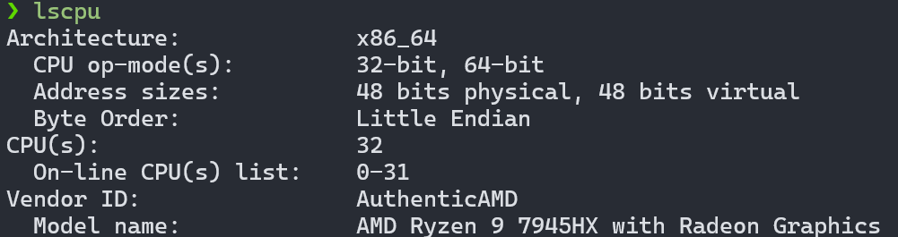
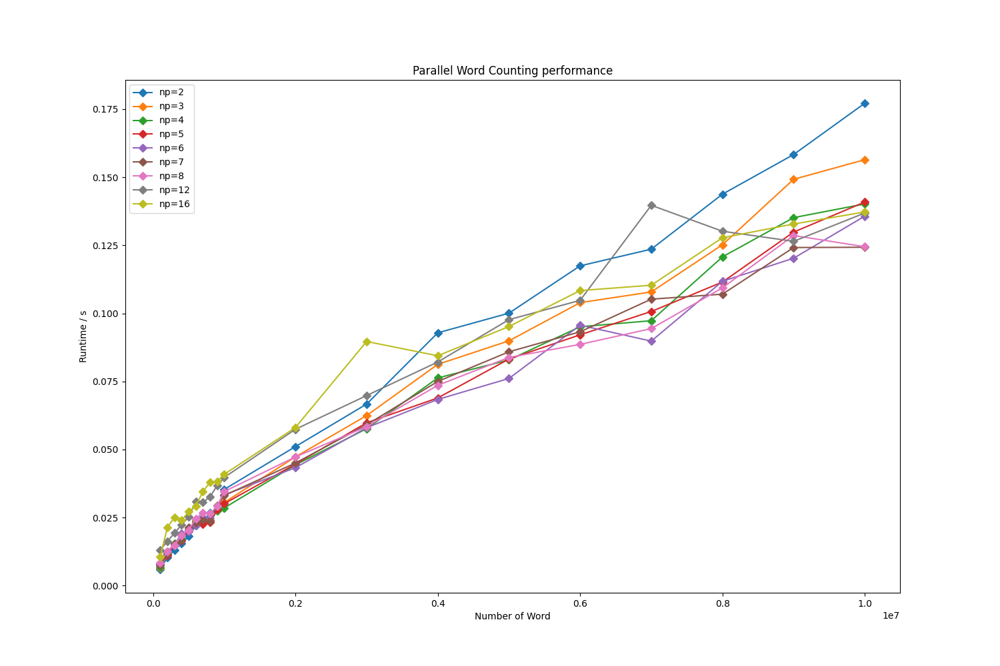
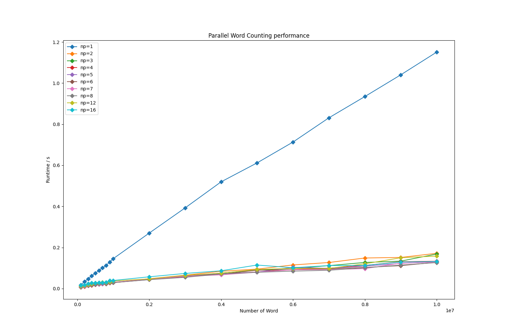

# Project 8: MapReduce
## 简介
介绍MapReduce框架的工作原理，并实现一个 MapReduce 程序来统计一组文档中每个单词的出现次数。

编写MapReduce程序，实现Map()和Reduce()函数，用于统计文档中单词的出现次数。
## 需求
### 输入
一组文档，每个文档包含若干单词。单词数量不少于 $10^5$。

### 输出
- 每个单词出现的次数。

- 输出结果需按单词出现次数的非降序排列，次数相同则按字典序排列。

- 分别实现串行和并行版本。


## 框架
MapReduce是一种编程模型，主要用于处理和生成大规模数据集。它通过在集群上运行并行、分布式算法来实现这一目标。


### Map
Map过程接收一个键值对作为输入，并产生一系列新的键值对作为输出。Map函数的目的是处理输入数据，并将其转换成适合进一步处理的形式。例如，在处理文本数据时，Map函数可能会将每一行文本拆分成单词，并为每个单词生成一个键值对，其中键是单词，值通常是数字1（表示出现一次）。大数据集被划分成多个分片，每个分片分配给一个Map任务，该任务在集群中的不同节点上并行执行。Map任务读取输入数据，执行用户定义的Map函数，并输出一系列中间键值对。

### Reduce（归约）
Reduce过程接收Map过程输出的中间键值对，并对具有相同键的所有值进行归约操作。归约操作的目的是将所有相关的数据聚合起来，例如，计算每个单词出现的总次数。
用户定义的Reduce函数会对每个键及其对应的所有值执行归约操作，并输出最终的结果。


## 实现
### 机器性能


### 并行版本
#### 思路
##### 数据结构：字典树
插入操作 (insert 方法)：从根节点开始，遍历单词中的每个字符。对于每个字符，计算其在字母表中的索引。
如果当前字符对应的子节点不存在，则创建一个新的节点，并更新当前节点指针。如果子节点存在，则移动到该子节点。
最后，更新最后一个节点的频率。

合并操作 (merge 方法)：递归地合并两个字典树。如果当前节点在第一个树中不存在，则从第二个树复制节点。如果两个树的当前节点都存在，则将第二个树节点的频率加到第一个树上。
递归地合并所有子节点。

提取操作 (extract 方法)：递归地遍历字典树，提取所有单词及其频率。构建当前的前缀字符串，并在找到有效单词（频率大于0）时将其添加到列表中。

###### 伪代码
```c++
class DictTree:
    // 初始化字典树的数据结构

    // 插入单词及其频率
    function insert(word, freq):
        curr = root
        len = min(length of word, WORD_LENGTH)
        for i from 0 to len-1:
            index = word[i] - 'a'
            if dict[curr].child[index] == -1:
                dict[size] = Node(word[i], 0)
                dict[curr].child[index] = size
                curr = size
                size = size + 1
            else:
                curr = dict[curr].child[index]
        dict[curr].freq = dict[curr].freq + freq

    // 合并两个字典树
    function merge(other, node1, node2):
        if node1 == -1:
            dict[size] = Node(other.dict[node2].ch, other.dict[node2].freq)
            node1 = size
            size = size + 1
        else:
            dict[node1].freq = dict[node1].freq + other.dict[node2].freq
        for i from 0 to DTREE_CHILD-1:
            if other.dict[node2].child[i] != -1:
                t = (dict[node1].child[i] == -1) ? size : dict[node1].child[i]
                merge(other, dict[node1].child[i], other.dict[node2].child[i])
                dict[node1].child[i] = t

    // 从字典树中提取所有单词及其频率
    function extract(list, prefix, node):
        if node == -1:
            return
        if node != root:
            prefix = prefix + dict[node].ch
        if dict[node].freq > 0:
            list.add(prefix, dict[node].freq)
        for i from 0 to DTREE_CHILD-1:
            if dict[node].child[i] != -1:
                extract(list, prefix, dict[node].child[i])
        if node != root:
            prefix = prefix[0:length of prefix - 1]

```
#### 算法设计
- 使用MPI_Init初始化并行环境，并获取进程总数（world_size）和当前进程的排名（world_rank）。
- 在主进程（rank 0）上读取输入文件，并将文件内容分配给一个字符数组。
- 将数据的大小（N）广播到所有进程。
- 所有进程根据其排名分配内存以存储其负责处理的数据部分。
- 使用MPI_Scatterv将数据分发到各个进程。每个进程接收到的数据块大小由sendcounts和displs数组指定。
- 每个进程在其分配的数据块上构建一个字典树，用于统计单词出现次数。
- 通过一系列的发送和接收操作，将所有进程上的字典树归约到主进程。这个过程是通过两两合并实现的，直到只剩下一个进程。
- 在主进程上，从字典树中提取单词及其频率，并按频率对结果进行排序。
- 将排序后的单词及其频率写入输出文件，并打印处理时间。

##### 伪代码

```c++
// 初始化并行环境
MPI_Init()
获取进程总数 world_size
获取当前进程排名 world_rank

// 主进程读取输入文件
if (world_rank == 0) then
    读取文件 filename 到 data

// 广播数据大小 N 到所有进程
MPI_Bcast(N)

// 所有进程分配内存
if (world_rank != 0) then
    分配内存 data 大小为 N * WORD_LENGTH

// 计算每个进程的数据块大小
计算 size_per_rank
初始化 sendcounts 和 displs

// 分发数据到各个进程
MPI_Scatterv(data, sendcounts, displs)

// 构建字典树
for (每个单词 in 接收到的数据) do
    tree->insert(单词, 1)

// 归约字典树到主进程
for (pnum = world_size downto 1) do
    next_pnum = (pnum + 1) / 2
    if (world_rank >= next_pnum) then
        发送 tree 到 world_rank - next_pnum
    else if (world_rank < pnum - next_pnum) then
        接收 tree_recv
        tree->merge(tree_recv)

// 主进程提取、排序并输出结果
if (world_rank == 0) then
    提取 tree 中的单词和频率到 list
    排序 list
    写入排序后的结果到 out_filename
    打印处理时间

// 清理资源
释放内存(data, tree, tree_recv, sendcounts, displs)

// 结束并行环境
MPI_Finalize()
```


### 串行版本

#### 思路
- 对于每个单词，构建一个Trie树（前缀树）。

- 将单词出现次数记录在每个单词的结束节点。

- 使用 dfs 遍历树，收集所有单词的数量和字符串。

- 使用 sort 按照出现次数和字典序进行排序。

- 将排序后的结果写入文件。

#### 伪代码

```c++
定义节点结构 Node：
    字符指针数组 sons[26]
    以此结尾单词出现次数 num

初始化根节点 root

定义全局变量：
    整数 n, m
    向量 sort_list 存储单词数量和字符串对

定义深度优先搜索函数 dfs(p, s)：
    如果 p 的 num 不为 0：
        将 (p 的 num, s) 添加到 sort_list
    对于每个字母 i：
        如果 p 的 sons[i] 不为空：
            调用 dfs(p 的 sons[i], s + 字母 i)

定义比较函数 cmp(a, b)：
    如果 单词出现次数不同：
        出现次数排序
    否则：
        字典序排序

重定向输入流到文件
读取 n
对于 每个单词：
    读取字符串 s
    设置 p 为 字典树的 root
    对于 s 中的每个字符：
        计算索引 index，此处为 s[i] - 'a'
        如果 p 的 sons[index] 为空：
            创建新节点
        更新 p 为 p 的 sons[index]
    p 的 num 加 1，即单词出现次数加 1
    更新 m 为最大值(m, p 的 num)

遍历整棵树，并统计所有单词
对 sort_list 进行排序，使用 cmp 作为比较函数

重定向输出流到文件
对于 sort_list 中的每个元素：
    将元素写入文件
```

## 测试
### 数据生成
#### 数据获取
从网上获得英文小说原文：

[Harry Potter](https://github.com/bobdeng/owlreader/tree/master/ERead/assets/books)

[Lord of the Rings](https://github.com/ganesh-k13/shell/tree/master/test_search/www.glozman.com/TextPages)

[Star Wars](https://github.com/ganesh-k13/shell/tree/master/test_search/www.glozman.com/TextPages)

[A Record of a Mortal's Journey to Immortality: Immortal Realm](https://novelbin.com/b/a-record-of-a-mortals-journey-to-immortality-immortal-realm)

[Charlie And The Chocolate Factory](https://archive.org/stream/CharlieAndTheChocolateFactory/Charlie%20and%20the%20Chocolate%20Factory_djvu.txt)

[The Great Gatsby](https://github.com/bobdeng/owlreader/blob/master/ERead/assets/books/The%20Great%20Gatsby.txt)

#### 数据清洗
将数据转换为小写，去除标点符号，分词。并分割为大小从 $100000$ 到 $900000$ 的文件，格式为：
```
n
word1 
word2

...

wordn
```
其中 $n$ 为单词出现的总次数。

#### 代码实现

```c++
重定向标准输入到 "1.txt"
重定向标准输出到 "./1/1.txt"
输出 100000 作为单词总数

初始化变量：
    长整数 n 为 0, maxnum 为 0
    字符串 s
    整数 j 为 1, mo 为 100000, m 为 3, nn 为 1

当从标准输入读取到单词 s 时：
    初始化空字符串 str
    对于 s 中的每个字符：
        如果字符是字母或撇号：
            如果不是撇号，将字符添加到 str
        否则：
            如果字符是大写字母，转换为小写并添加到 str
            否则：
                更新 maxnum 为 str 长度和 maxnum 中的最大值
                如果 str 长度大于 0 且小于 16：
                    输出 str
                    n 加 1
                    清空 str
                    如果 n 大于等于 mo：
                        mo 加 100000
                        n 重置为 0
                        nn 加 1
                        重定向标准输出到 "./" + nn + "/1.txt"
                        输出 mo

如果 str 长度大于 0 且小于 16：
    输出 str
    n 加 1
    清空 str
    如果 n 大于等于 mo：
        mo 加 100000
        n 重置为 0
        nn 加 1
        重定向标准输出到 "./" + nn + "/1.txt"
        输出 mo

```

### 性能测试




可以发现，串行版本与并行版本时间复杂度增长速度都近似于线性，但并行版本的性能优势更加明显。并行版本随着核心数的增加，效率先升高再下降，因为并行数量增加，计算速度加快，但是需要更多的通信开销。

## 复杂度分析
### 串行版本
#### 时间复杂度
串行版本的字典树插入复杂度为 $O(nm)$，其中 $n$ 为单词总数，$m$ 为单词长度。因为字典树的高度小于等于单词长度，每个单词遍历高度不高于字典树高度，所以插入操作的时间复杂度为 $O(nm)$。

串行版本dfs遍历字典树的时间复杂度为 $O(nm)$，其中 $n$ 为单词总数，$m$ 为单词长度。因为每个单词都要遍历一次字典树，所以时间复杂度为 $O(nm)$。

串行版本的排序操作复杂度为 $O(n_2logn_2)$，其中 $n_2$ 为不同单词数量，因为需要对 $n——2$ 个单词进行排序，所以时间复杂度为 $O(n_2logn_2)$。

串行版本的总时间复杂度为 $O(nm + n_2logn_2)$，其中 $n$ 为单词总数，$m$ 为单词长度。

#### 空间复杂度
串行版本的字典树空间复杂度为 $O(nm)$，其中 $n$ 为单词总数，$m$ 为单词长度。因为字典树的高度小于等于单词长度，每个单词对应字典树的节点，所以空间复杂度为 $O(nm)$。

串行版本的排序列表空间复杂度为 $O(n)$，其中 $n$ 为单词总数。因为需要存储 $n$ 个单词及其出现次数，所以空间复杂度为 $O(n)$。

串行版本的总空间复杂度为 $O(nm + n)$，其中 $n$ 为单词总数，$m$ 为单词长度。

### 并行版本
#### 时间复杂度
时间复杂度为 $O(nm/N+n_2logn_2)$，其中 $n$ 为单词总数，$m$ 为单词长度，$N$ 为进程数。因为每个进程处理的数据量为 $n/N$，所以每个进程的处理时间为 $O(nm/N)$。由于最后的排序操作需要所有进程的结果，所以排序操作的时间复杂度为 $O(n_2logn_2)$。

#### 空间复杂度
空间复杂度为 $O(nm)$，其中 $n$ 为单词总数，$m$ 为单词长度，$N$ 为进程数。因为每个进程处理的数据量为 $n/N$，所以每个进程的字典树空间复杂度为 $O(nm/N)$。
